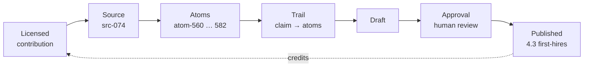

# How the Moral Fabric IT security checklist flows into the wiki

> **Super-summary.** The August 2026 **[Moral Fabric IT security checklist for employees](https://help.moralfabric.org/p/2FWCKzNlxXsT7j/IT-security-checklist-for-employees)** (licensed for use in this project) was turned into **23 traceable knowledge units** and published on **4.3 IT Administration & User Support — First Hires**. The wiki page credits Moral Fabric in the footer, and **every published lesson can be traced back** — through the synthesis trail → atoms → source record → the licensed contribution write-up — in five clicks. Nothing is hidden; it all lives in this repository.

A traceability map so Moral Fabric (and maintainers) can see exactly how the checklist became published wiki content — and follow **any** published lesson back to the original source. Content was synthesised into startup ops language for the 2–10 person stage; recurring (monthly/quarterly/yearly) items from the checklist were scoped mainly to the evolution section and future **4.3 @ early-revenue** work.

---

## The chain at a glance

```
Licensed contribution          (wiki-pipeline/contributions/ — cleaned mapping to 4.3)
        ↓
Source record                  (src-074 — URL, rights note, tags)
        ↓
Atoms                          (atom-560 … atom-582 — each lesson with a "why")
        ↓
Trail                          (synthesis: which atoms became which claim)
        ↓
Draft  →  Human review (approval)   (approve / edit / reject each claim)
        ↓
Published wiki page            (credited to Moral Fabric in the footer)
```



---

## 1. Where Moral Fabric is credited (the wiki)

The published page ends with:

> The IT security baseline content in this wiki entry is based on **[Moral Fabric's IT security checklist for employees](https://help.moralfabric.org/p/2FWCKzNlxXsT7j/IT-security-checklist-for-employees)**, used with permission.
> *(plus an IT/security informational disclaimer)*

**Page whose lessons come directly from this checklist (August 2026):**

- [4.3 IT Administration & User Support — First Hires](https://github.com/aksie/ducttape-to-coo/blob/main/wiki/processes/legal/4.3--first-hires.md)

**Not yet published from this source:** Moral Fabric's **monthly** recurring checks (downloads/desktop/recycle hygiene) were extracted as `atom-578` but **rejected at review** (claim **c-018**) — intended for a future **4.3 @ early-revenue** addendum, not the first-hires page. **Quarterly/yearly** recurring checks appear in the evolution section via approved claim **c-019** (`atom-579`).

Individual bullets also cite **HN corroboration** where the checklist aligns with community practice (`src-051` access inventory, `src-052` password-manager hygiene). Those lessons trace to different source records; Moral Fabric remains the primary licensed input.

---

## 2. The lessons → atoms

Each distinct operational claim from the checklist became one **atom** — a single knowledge unit with claim, paraphrase, and *why it matters*. There are **23** atoms from `src-074`:

| Atom range | Type mix | Checklist section (Moral Fabric) |
|---|---|---|
| `atom-560` … `atom-562` | `target_state` | Devices — supported OS, lock, encryption, endpoint protection |
| `atom-563` … `atom-566` | `target_state` | Passwords, SSO/MFA, policy sign-off, access inventory |
| `atom-567` … `atom-572` | `action` | One-off setup: identity, devices, password migration, onboarding doc, policy, access list |
| `atom-573` … `atom-577` | `warning_sign` | Failure modes (browser passwords, no MFA, unencrypted devices, slow provisioning, unsigned policy) |
| `atom-578` … `atom-579` | `evolution` | Recurring monthly / quarterly+yearly rhythm → early-revenue stage |
| `atom-580` … `atom-582` | `tool_resource` | Password manager, Moral Fabric template, Google Security Checkup / phishing quiz |

Every atom is tagged `extracted_by: human:moral-fabric` (elevated weight in synthesis). Atoms live in [`wiki-pipeline/atoms/`](https://github.com/aksie/ducttape-to-coo/tree/main/wiki-pipeline/atoms).

---

## 3. Atoms → source → contribution

Each atom names `source_id: src-074`. The source record points to the **licensed contribution** — the cleaned write-up mapped to wiki sections and process 4.3:

- [src-074.md](https://github.com/aksie/ducttape-to-coo/blob/main/wiki-pipeline/sources/src-074.md) → [legal-and-other-ops--it-security-checklist-moral-fabric.md](https://github.com/aksie/ducttape-to-coo/blob/main/wiki-pipeline/contributions/legal-and-other-ops--it-security-checklist-moral-fabric.md)

**Original (external):** [IT security checklist for employees — Moral Fabric Help Center](https://help.moralfabric.org/p/2FWCKzNlxXsT7j/IT-security-checklist-for-employees)

**Rights:** recorded in source frontmatter (`rights_note: licensed for use in Duct Tape to COO wiki with attribution to Moral Fabric`).

---

## 4. Trace one lesson end-to-end (worked example)

**Lesson: "Every work device runs a supported OS with automatic updates, screen lock, disk encryption, and active endpoint protection."** (on the 4.3 First Hires page)

1. **Wiki** — [4.3--first-hires.md](https://github.com/aksie/ducttape-to-coo/blob/main/wiki/processes/legal/4.3--first-hires.md), target-state bullet with `<!-- sources: src-074 (Moral Fabric, human:moral-fabric) -->`
2. **Trail** — [it-administration/first-hires/trail.md](https://github.com/aksie/ducttape-to-coo/blob/main/wiki-pipeline/entries/legal-and-other-ops/it-administration/first-hires/trail.md) → claim **c-003** → atoms `560`, `561`, `562` (+ action atom `568` for the one-off device runbook)
3. **Atoms** — [atom-560.md](https://github.com/aksie/ducttape-to-coo/blob/main/wiki-pipeline/atoms/atom-560.md) (supported OS + auto-updates), [atom-561.md](https://github.com/aksie/ducttape-to-coo/blob/main/wiki-pipeline/atoms/atom-561.md) (lock + encryption), [atom-562.md](https://github.com/aksie/ducttape-to-coo/blob/main/wiki-pipeline/atoms/atom-562.md) (endpoint protection)
4. **Source** — [src-074.md](https://github.com/aksie/ducttape-to-coo/blob/main/wiki-pipeline/sources/src-074.md)
5. **Contribution** — [legal-and-other-ops--it-security-checklist-moral-fabric.md](https://github.com/aksie/ducttape-to-coo/blob/main/wiki-pipeline/contributions/legal-and-other-ops--it-security-checklist-moral-fabric.md) → *What good looks like* / device one-off checks

The same five-step trace works for every Moral Fabric–sourced bullet on the page.

---

## 5. Full map (wiki page ↔ claims ↔ atoms ↔ source)

| Published wiki page | Trail folder | Claims | Primary atoms | Source | Contribution |
|---|---|---|---|---|---|
| [4.3 IT Admin — First Hires](https://github.com/aksie/ducttape-to-coo/blob/main/wiki/processes/legal/4.3--first-hires.md) | [it-administration/first-hires](https://github.com/aksie/ducttape-to-coo/tree/main/wiki-pipeline/entries/legal-and-other-ops/it-administration/first-hires) | c-001 … c-022 (21 published) | `atom-560` … `atom-582` | `src-074` (+ `src-051`, `src-052` on select claims) | [checklist contribution](https://github.com/aksie/ducttape-to-coo/blob/main/wiki-pipeline/contributions/legal-and-other-ops--it-security-checklist-moral-fabric.md) |

**Corpus health (Phase 1):** [corpus_health-legal-and-other-ops-first-hires-it-administration.md](https://github.com/aksie/ducttape-to-coo/blob/main/wiki-pipeline/corpus_health-legal-and-other-ops-first-hires-it-administration.md)

---

## 6. What the human review changed

Phase 3 recorded a decision on every claim in [approval.md](https://github.com/aksie/ducttape-to-coo/blob/main/wiki-pipeline/entries/legal-and-other-ops/it-administration/first-hires/approval.md) (reviewed 2026-08-20):

| Outcome | Count | Notes |
|---|---|---|
| **Approved** | 21 | Includes evolution claim **c-019** (quarterly MFA/access + yearly policy/phishing refresh) |
| **Rejected** | 1 | **c-018** — monthly device hygiene in evolution; reviewer judged it belongs at **early-revenue**, not first-hires. Atom `atom-578` retained in pipeline for a future 4.3 addendum. |
| **Approved with edit** | 0 | — |

Published wiki commit: [`3358e1d`](https://github.com/aksie/ducttape-to-coo/commit/3358e1d) — *Publish 4.3 IT Administration at first hires from Moral Fabric checklist.*

---

## 7. Related wiki pages (cross-links, not Moral Fabric–sourced)

The 4.3 first-hires page intentionally cross-references:

- [3.3 Onboarding — First Hires](https://github.com/aksie/ducttape-to-coo/blob/main/wiki/processes/people/3.3--first-hires.md) — new-hire IT one-pager linked from onboarding
- [3.4 Offboarding — First Hires](https://github.com/aksie/ducttape-to-coo/blob/main/wiki/processes/people/3.4--first-hires.md) — master access list + same-day revoke (HN-sourced `src-051` et al.)
- [4.3 IT Admin — Early Revenue](https://github.com/aksie/ducttape-to-coo/blob/main/wiki/processes/legal/4.3--early-revenue.md) — evolution target; home for deferred recurring checks

Those pages have their own source provenance; Moral Fabric credit applies only where `src-074` appears in the bullet's `<!-- sources: ... -->` comment or the page attribution footer above.
