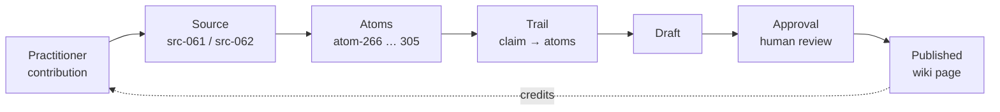

# How the Trailhead legal contribution flows into the wiki

> **Super-summary.** The June 2026 **Trailhead Legal Scan** working session was turned into **40 traceable knowledge units** and published across the legal wiki — **4.1 Governance & Corporate**, **4.5 Internal & Labour**, **4.6 Privacy & IP**, and a **First Legal Hire** note. Every legal page credits Trailhead, and **every published lesson can be traced back** — through the synthesis trail → atoms → source record → the original session write-up — in five clicks. Nothing is hidden; it all lives in this repository.

A traceability map so Trailhead can see exactly how the session became published wiki content — and follow **any** published lesson back to the original input. The session was held in Dutch, summarised in English, company names removed, and approved for use.

---

## The chain at a glance

```
Practitioner contribution      (the cleaned write-up of the session)
        ↓
Source record                  (src-061 / src-062 — provenance + tags)
        ↓
Atoms                          (each lesson = one knowledge unit, with a "why")
        ↓
Trail                          (synthesis: which atoms became which claim)
        ↓
Draft  →  Human review (approval)   (approve / edit / reject each claim)
        ↓
Published wiki page            (credited to Trailhead in the footer)
```



---

## 1. Where Trailhead is credited (the wiki)

Every legal wiki page ends with:

> The Legal part of the Diagnosis and Wiki/Knowledgebase is based on **[Trailhead's Legal Scan](https://www.trailheadlegal.nl/)** and made with input from **Marije van Akkerveeken**.
> *(plus a "not legal advice" disclaimer)*

The pages whose **lessons come directly from the Trailhead scan**:

- [4.1 Governance & Corporate — Growth](https://github.com/aksie/ducttape-to-coo/blob/main/wiki/processes/legal/4.1--growth.md) and [Early Revenue](https://github.com/aksie/ducttape-to-coo/blob/main/wiki/processes/legal/4.1--early-revenue.md)
- [4.5 Internal & Labour — First Hires](https://github.com/aksie/ducttape-to-coo/blob/main/wiki/processes/legal/4.5--first-hires.md) and [Growth](https://github.com/aksie/ducttape-to-coo/blob/main/wiki/processes/legal/4.5--growth.md)
- [4.6 Privacy & IP — First Hires](https://github.com/aksie/ducttape-to-coo/blob/main/wiki/processes/legal/4.6--first-hires.md) and [Growth](https://github.com/aksie/ducttape-to-coo/blob/main/wiki/processes/legal/4.6--growth.md)
- [The First Legal Hire](https://github.com/aksie/ducttape-to-coo/blob/main/wiki/processes/legal/first-legal-hire.md) — the cross-cutting note

The credit also appears on the remaining legal pages ([4.1 foundation](https://github.com/aksie/ducttape-to-coo/blob/main/wiki/processes/legal/4.1--foundation.md)/[first-hires](https://github.com/aksie/ducttape-to-coo/blob/main/wiki/processes/legal/4.1--first-hires.md)/[scaled](https://github.com/aksie/ducttape-to-coo/blob/main/wiki/processes/legal/4.1--scaled.md), [4.6 foundation](https://github.com/aksie/ducttape-to-coo/blob/main/wiki/processes/legal/4.6--foundation.md)/[early-revenue](https://github.com/aksie/ducttape-to-coo/blob/main/wiki/processes/legal/4.6--early-revenue.md)) for consistency — those pages draw on other practitioner interviews, so their *lessons* trace to different sources, but Trailhead is acknowledged across the legal section.

---

## 2. The lessons → atoms

Each lesson from the session became one or more **atoms** — a single knowledge unit recording the claim, a source quote/paraphrase, and *why it matters*. There are **40** atoms from this contribution:

| Source | Atoms | Contribution |
|---|---|---|
| `src-061` (legal scan walkthrough) | `atom-266` … `atom-298` (33) | [legal--legal-scan-walkthrough.md](https://github.com/aksie/ducttape-to-coo/blob/main/wiki-pipeline/contributions/legal--legal-scan-walkthrough.md) |
| `src-062` (first legal hire) | `atom-299` … `atom-305` (7) | [legal--first-legal-hire.md](https://github.com/aksie/ducttape-to-coo/blob/main/wiki-pipeline/contributions/legal--first-legal-hire.md) |

Every one of these atoms is tagged `extracted_by: human:trailhead-legal`, which gives them **elevated weight** in synthesis (practitioner knowledge counts for more than machine-extracted text). The atoms live in [`wiki-pipeline/atoms/`](https://github.com/aksie/ducttape-to-coo/tree/main/wiki-pipeline/atoms).

---

## 3. Atoms → source → practitioner contribution

Each atom names its `source_id` (`src-061` or `src-062`). The source record points back to the **practitioner contribution** — the cleaned, approved write-up of the session, organised in the scan's own questionnaire order:

- [src-061.md](https://github.com/aksie/ducttape-to-coo/blob/main/wiki-pipeline/sources/src-061.md) → [legal--legal-scan-walkthrough.md](https://github.com/aksie/ducttape-to-coo/blob/main/wiki-pipeline/contributions/legal--legal-scan-walkthrough.md)
- [src-062.md](https://github.com/aksie/ducttape-to-coo/blob/main/wiki-pipeline/sources/src-062.md) → [legal--first-legal-hire.md](https://github.com/aksie/ducttape-to-coo/blob/main/wiki-pipeline/contributions/legal--first-legal-hire.md)

---

## 4. Trace one lesson end-to-end (worked example)

**Lesson: "You know your reserved matters and document their approvals."** (on the 4.1 Growth page)

1. **Wiki** — [4.1--growth.md](https://github.com/aksie/ducttape-to-coo/blob/main/wiki/processes/legal/4.1--growth.md), bullet *"You know your reserved matters and document their approvals."* with `<!-- sources: src-061 (Trailhead legal scan, human:trailhead-legal) -->`
2. **Trail** — [governance-corporate/growth/trail.md](https://github.com/aksie/ducttape-to-coo/blob/main/wiki-pipeline/entries/legal-and-other-ops/governance-corporate/growth/trail.md) → claim **c-003** → *Supporting atom: `atom-271`*
3. **Atom** — [atom-271.md](https://github.com/aksie/ducttape-to-coo/blob/main/wiki-pipeline/atoms/atom-271.md) → claim + the actual paraphrase *("…the reserved matters question; use that term — it resonates")* + why *(investor consent rights bite here)*
4. **Source** — [src-061.md](https://github.com/aksie/ducttape-to-coo/blob/main/wiki-pipeline/sources/src-061.md) (Trailhead legal scan walkthrough)
5. **Contribution** — [legal--legal-scan-walkthrough.md](https://github.com/aksie/ducttape-to-coo/blob/main/wiki-pipeline/contributions/legal--legal-scan-walkthrough.md) → §1 *Corporate governance*

The same five-step trace works for every bullet on every Trailhead-sourced page.

---

## 5. Full map (wiki page ↔ atoms ↔ source ↔ contribution)

| Published wiki page | Trail (synthesis) folder | Atoms | Source | Contribution |
|---|---|---|---|---|
| [4.1 Governance & Corporate — Growth](https://github.com/aksie/ducttape-to-coo/blob/main/wiki/processes/legal/4.1--growth.md) | [growth](https://github.com/aksie/ducttape-to-coo/tree/main/wiki-pipeline/entries/legal-and-other-ops/governance-corporate/growth) | `atom-266, 269–277, 286–288, 297–298` | `src-061` | [walkthrough](https://github.com/aksie/ducttape-to-coo/blob/main/wiki-pipeline/contributions/legal--legal-scan-walkthrough.md) |
| [4.1 Governance & Corporate — Early Revenue](https://github.com/aksie/ducttape-to-coo/blob/main/wiki/processes/legal/4.1--early-revenue.md) | [early-revenue](https://github.com/aksie/ducttape-to-coo/tree/main/wiki-pipeline/entries/legal-and-other-ops/governance-corporate/early-revenue) | `atom-267, 268` | `src-061` | [walkthrough](https://github.com/aksie/ducttape-to-coo/blob/main/wiki-pipeline/contributions/legal--legal-scan-walkthrough.md) |
| [4.5 Internal & Labour — First Hires](https://github.com/aksie/ducttape-to-coo/blob/main/wiki/processes/legal/4.5--first-hires.md) | [first-hires](https://github.com/aksie/ducttape-to-coo/tree/main/wiki-pipeline/entries/legal-and-other-ops/internal-labour/first-hires) | `atom-278–282, 284` | `src-061` | [walkthrough](https://github.com/aksie/ducttape-to-coo/blob/main/wiki-pipeline/contributions/legal--legal-scan-walkthrough.md) |
| [4.5 Internal & Labour — Growth](https://github.com/aksie/ducttape-to-coo/blob/main/wiki/processes/legal/4.5--growth.md) | [growth](https://github.com/aksie/ducttape-to-coo/tree/main/wiki-pipeline/entries/legal-and-other-ops/internal-labour/growth) | `atom-283, 285` | `src-061` | [walkthrough](https://github.com/aksie/ducttape-to-coo/blob/main/wiki-pipeline/contributions/legal--legal-scan-walkthrough.md) |
| [4.6 Privacy & IP — First Hires](https://github.com/aksie/ducttape-to-coo/blob/main/wiki/processes/legal/4.6--first-hires.md) | [first-hires](https://github.com/aksie/ducttape-to-coo/tree/main/wiki-pipeline/entries/legal-and-other-ops/privacy-ip/first-hires) | `atom-289, 292` | `src-061` | [walkthrough](https://github.com/aksie/ducttape-to-coo/blob/main/wiki-pipeline/contributions/legal--legal-scan-walkthrough.md) |
| [4.6 Privacy & IP — Growth](https://github.com/aksie/ducttape-to-coo/blob/main/wiki/processes/legal/4.6--growth.md) | [growth](https://github.com/aksie/ducttape-to-coo/tree/main/wiki-pipeline/entries/legal-and-other-ops/privacy-ip/growth) | `atom-290–296` (less 292) | `src-061` | [walkthrough](https://github.com/aksie/ducttape-to-coo/blob/main/wiki-pipeline/contributions/legal--legal-scan-walkthrough.md) |
| [The First Legal Hire](https://github.com/aksie/ducttape-to-coo/blob/main/wiki/processes/legal/first-legal-hire.md) | [first-legal-hire/growth](https://github.com/aksie/ducttape-to-coo/tree/main/wiki-pipeline/entries/legal-and-other-ops/first-legal-hire/growth) | `atom-299–305` | `src-062` | [first legal hire](https://github.com/aksie/ducttape-to-coo/blob/main/wiki-pipeline/contributions/legal--first-legal-hire.md) |

---

## 6. What the human review changed

Phase 3 ("human review") recorded a decision on **every** claim in an `approval.md` next to each draft — approved, approved-with-edit, or rejected. So Trailhead can see not just what was published but what was adjusted, e.g.:

- Edits added NL specifics (e.g. "Chamber of Commerce" / *derdenwerking*, *wet DBA* indemnity wording).
- One claim was **rejected** (a "separate software BV" idea — judged too situation-specific) and does not appear in the wiki.

Decisions live in the `approval.md` file inside each [trail folder](https://github.com/aksie/ducttape-to-coo/tree/main/wiki-pipeline/entries/legal-and-other-ops).
